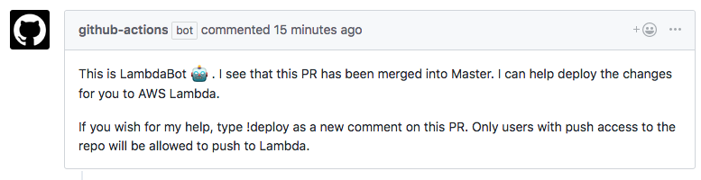

# Deploy Lambda Actions

This is a pair of actions to help deploy AWS Lambda functions with aws-cli.

## pr-comment

the `pr-comment` action is to be used to comment on a merged PR to offer to deploy the lambda function to AWS.

The only secret it needs is the `GITHUB_TOKEN` variable to have access to push the comment to the required PR.



### Usage

In this example workflow, I am using [lannonbr/pr-merged-action](https://github.com/lannonbr/pr-merged-action) to check if the PR was merged and if so create the comment.

```workflow
workflow "Push Comment on PR merge" {
  on = "pull_request"
  resolves = ["Push Comment on PR"]
}

action "Check for PR Merge" {
  uses = "lannonbr/pr-merged-action@master"
  args = "true"
}

action "Push Comment on PR" {
  uses = "lannonbr/deploy-lambda-function/pr-comment@master"
  secrets = ["GITHUB_TOKEN"]
  needs = ["Check for PR Merge"]
}
```

## deploy-lambda

This action does the process of deploying the lambda function to AWS. An example workflow is seen below where it watches on a PR comments to see if a comment by someone who has push access (which can be obtained with [lannonbr/repo-push-check-action](https://github.com/lannonbr/repo-push-check-action)) writes "!deploy". If such, it uses the AWS cli tool with the various credentials to push the code up to AWS.

The credentials needed are as follows:

- `AWS_ACCESS_KEY_ID`: Access Key for AWS.
- `AWS_SECRET_ACCESS_KEY`: Access Key Secret for AWS
- `AWS_DEFAULT_REGION`: AWS Region (ex: us-east-1)
- `AWS_LAMBDA_NAME`: Name of the Lambda function

### Usage

```workflow
workflow "Deploy to Lambda" {
  on = "issue_comment"
  resolves = ["Deploy if comment contains !deploy"]
}

action "Check Push Access" {
  uses = "lannonbr/repo-push-check-action@master"
  secrets = ["GITHUB_TOKEN"]
}

action "Deploy if comment contains !deploy" {
  uses = "lannonbr/deploy-lambda-action/deploy-lambda@master"
  needs = ["Check Push Access"]
  secrets = ["AWS_ACCESS_KEY_ID", "AWS_DEFAULT_REGION", "AWS_LAMBDA_NAME", "AWS_SECRET_ACCESS_KEY"]
}
```
